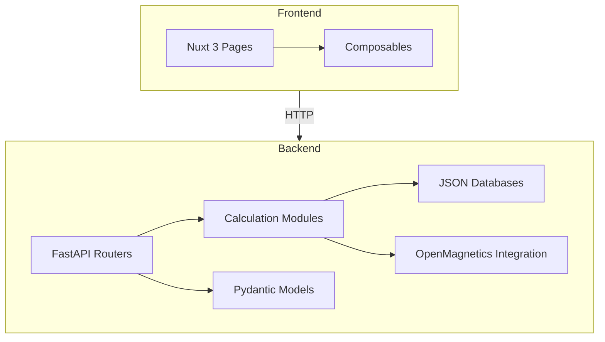
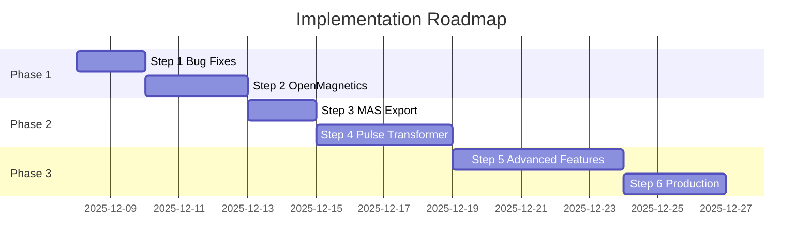

# Power Transformer Designer — Comprehensive Implementation Plan
## Step-by-Step Roadmap with OpenMagnetics Integration

**Created**: 2025-12-07  
**Author**: Lumina (ESA)  
**Status**: PLANNING

---

## Table of Contents

1. [Step 0: Existing Code Analysis & Improvements](#step-0-existing-code-analysis--improvements)
2. [Step 1: Code Quality & Bug Fixes](#step-1-code-quality--bug-fixes)
3. [Step 2: Deep OpenMagnetics Integration](#step-2-deep-openmagnetics-integration)
4. [Step 3: MAS Export & FEA Workflow](#step-3-mas-export--fea-workflow)
5. [Step 4: Pulse Transformer Support](#step-4-pulse-transformer-support)
6. [Step 5: Advanced Features](#step-5-advanced-features)
7. [Step 6: Production Readiness](#step-6-production-readiness)
8. [Timeline Summary](#timeline-summary)

---

## Step 0: Existing Code Analysis & Improvements

### 0.1 Architecture Overview



### 0.2 Current Implementation Status

| Component | Files | Status | Quality |
|-----------|-------|--------|---------|
| **Backend Core** | `main.py`, `routers/` | ✅ Complete | Good |
| **Ap/Kg Methods** | `calculations/ap_method.py`, `kg_method.py` | ✅ Complete | Good |
| **Erickson Kgfe** | `calculations/erickson_method.py` | ✅ Complete | Good |
| **Loss Calculations** | `calculations/losses.py` | ✅ Calibrated | Good |
| **Thermal Model** | `calculations/thermal.py` | ✅ Complete | Good |
| **Validation System** | `calculations/validation.py` | ✅ Complete | Good |
| **OpenMagnetics DB** | `integrations/openmagnetics.py` | ✅ Basic | Needs Enhancement |
| **Core Database** | `data/cores.json` | ⚠️ Limited | Expand |
| **Material Database** | `data/materials.json` | ⚠️ Limited | Expand |
| **Frontend UI** | `pages/design/transformer.vue` | ✅ Complete | Good |
| **Inductor Design** | `pages/design/inductor.vue` | ⚠️ Basic | Needs Implementation |
| **Pulse Transformer** | - | ❌ Not Started | Phase 2 |
| **MAS Export** | - | ❌ Not Started | Priority |
| **PDF Reports** | - | ❌ Not Started | Future |

### 0.3 Code Quality Issues & Recommendations

#### 🔴 Critical Issues

1. **OpenMagnetics MLT/At Missing**
   - **Location**: [`backend/routers/transformer.py:421-424`](backend/routers/transformer.py:421)
   - **Issue**: Default values used when OpenMagnetics core lacks MLT_cm, At_cm2
   - **Impact**: Inaccurate winding resistance and thermal calculations
   - **Fix**: Calculate MLT from core geometry, At from surface dimensions

2. **Wire Gauge Selection Incomplete**
   - **Location**: [`backend/calculations/winding.py`](backend/calculations/winding.py)
   - **Issue**: No Litz wire recommendation for high frequencies
   - **Impact**: Underestimated AC resistance at >100kHz
   - **Fix**: Implement Litz wire selection with strand count calculation

3. **Material Database Limited**
   - **Location**: [`backend/data/materials.json`](backend/data/materials.json)
   - **Issue**: Only basic material properties, no temperature curves
   - **Impact**: Inaccurate loss predictions at different temperatures
   - **Fix**: Expand with temperature-dependent Steinmetz coefficients

#### 🟡 Medium Priority Issues

4. **Inductor Design Not Implemented**
   - **Location**: [`backend/routers/inductor.py`](backend/routers/inductor.py)
   - **Issue**: Endpoint exists but returns placeholder
   - **Impact**: Users cannot design inductors
   - **Fix**: Implement energy storage method with air gap calculation

5. **No Design Save/Load**
   - **Issue**: Designs are calculated but not persisted
   - **Impact**: Users must re-enter parameters each session
   - **Fix**: Add design storage (local storage or backend DB)

6. **No Export Functionality**
   - **Issue**: Cannot export designs to MAS, PDF, or CSV
   - **Impact**: No FEA integration, no documentation
   - **Fix**: Implement MAS export (priority), then PDF

7. **Frontend Type Safety**
   - **Location**: [`frontend/composables/useTransformerDesign.ts`](frontend/composables/useTransformerDesign.ts)
   - **Issue**: Some optional fields not properly typed
   - **Impact**: Runtime errors possible
   - **Fix**: Strict TypeScript interfaces matching Pydantic models

#### 🟢 Low Priority / Enhancements

8. **No Design Comparison View**
   - Allow side-by-side comparison of multiple designs

9. **No Unit Toggle (SI/Imperial)**
   - Some users prefer AWG wire gauges, others prefer mm

10. **No Core Loss Charts**
    - Visual B vs Pv curves would help material selection

11. **No Winding Diagram Generator**
    - Visual representation of layer stack

---

## Step 1: Code Quality & Bug Fixes

**Effort**: 6-8 hours

### 1.1 Fix OpenMagnetics Core Parameters

```python
# backend/integrations/openmagnetics.py - ENHANCEMENT

def calculate_MLT_from_geometry(core: dict) -> float:
    """
    Calculate Mean Length per Turn from core geometry.
    
    MLT ≈ 2*(width + depth) for E/ETD cores
    MLT ≈ π*(ID + OD)/2 for toroids
    """
    processed = core.get('processedDescription', {})
    depth = processed.get('depth', 0) * 100  # m to cm
    width = processed.get('width', 0) * 100
    
    shape = core.get('name', '').split()[0].upper()
    
    if shape in ['E', 'EE', 'EI', 'ETD', 'ER', 'EQ', 'EFD', 'EP', 'PQ', 'PM']:
        # E-type cores: MLT ≈ 2*(center leg width + winding depth)
        return 2 * (width + depth) * 0.8  # 0.8 factor for winding path
    elif shape in ['T', 'TC', 'TOROID']:
        # Toroids: MLT ≈ average circumference
        return math.pi * (width + depth) / 2
    else:
        # Default estimate
        return 2 * (width + depth) * 0.9

def calculate_surface_area_from_geometry(core: dict) -> float:
    """
    Calculate thermal surface area from core dimensions.
    
    At ≈ 2*(W*H + W*D + H*D) for box approximation
    """
    processed = core.get('processedDescription', {})
    width = processed.get('width', 0) * 100  # m to cm
    height = processed.get('height', 0) * 100
    depth = processed.get('depth', 0) * 100
    
    # Box surface area approximation (includes winding)
    return 2 * (width * height + width * depth + height * depth) * 0.6
```

**Files to Modify**:
- [ ] `backend/integrations/openmagnetics.py` - Add geometry calculations
- [ ] `backend/routers/transformer.py` - Use calculated values instead of defaults

### 1.2 Implement Litz Wire Selection

```python
# backend/calculations/winding.py - ENHANCEMENT

def recommend_litz_wire(
    required_area_cm2: float,
    frequency_Hz: float,
    max_strand_diameter_mm: float = None,
) -> dict:
    """
    Recommend Litz wire configuration for high-frequency applications.
    
    Rules:
    - Strand diameter should be < 2 × skin depth
    - Common strand gauges: 38, 40, 42, 44 AWG
    - Bundle in groups of 7, 19, 37, 65 (hex packing)
    """
    skin_depth_mm = calculate_skin_depth(frequency_Hz)
    max_strand_d = min(2 * skin_depth_mm, max_strand_diameter_mm or 0.2)
    
    # Select strand gauge
    if max_strand_d >= 0.1:
        strand_awg = 38  # 0.10 mm
    elif max_strand_d >= 0.08:
        strand_awg = 40  # 0.08 mm
    elif max_strand_d >= 0.06:
        strand_awg = 42  # 0.064 mm
    else:
        strand_awg = 44  # 0.051 mm
    
    strand_area_cm2 = awg_to_area(strand_awg)
    strands_needed = math.ceil(required_area_cm2 / strand_area_cm2)
    
    # Round to standard bundle sizes
    bundle_sizes = [7, 19, 37, 65, 127, 252]
    for size in bundle_sizes:
        if size >= strands_needed:
            strands_needed = size
            break
    
    return {
        'type': 'litz',
        'strand_awg': strand_awg,
        'strand_count': strands_needed,
        'total_area_cm2': strand_area_cm2 * strands_needed,
        'outer_diameter_mm': estimate_litz_od(strand_awg, strands_needed),
        'ac_factor': estimate_litz_ac_factor(strand_awg, strands_needed, frequency_Hz),
    }
```

**Files to Modify**:
- [ ] `backend/calculations/winding.py` - Add Litz wire functions
- [ ] `backend/routers/transformer.py` - Use Litz when frequency > 50kHz

### 1.3 Expand Material Database

```json
// backend/data/materials.json - EXPANSION

{
  "ferrite": {
    "N87": {
      "manufacturer": "TDK",
      "Bsat_T": 0.39,
      "mu_i": 2200,
      "steinmetz": {
        "k": 8.1e-7,
        "alpha": 1.46,
        "beta": 2.75,
        "reference_temp_C": 100,
        "temp_coefficients": {
          "25": 0.7,
          "60": 0.85,
          "80": 0.95,
          "100": 1.0,
          "120": 1.15
        }
      },
      "curie_temp_C": 210,
      "resistivity_ohm_m": 10,
      "datasheet_url": "https://product.tdk.com/info/en/catalog/datasheets/ferrite_mn-zn_material_characteristics_en.pdf"
    },
    "3C95": {
      "manufacturer": "Ferroxcube",
      "Bsat_T": 0.41,
      "mu_i": 3000,
      "steinmetz": {
        "k": 4.1e-7,
        "alpha": 1.46,
        "beta": 2.75,
        "reference_temp_C": 100
      }
    }
    // ... more materials
  }
}
```

**Files to Modify**:
- [ ] `backend/data/materials.json` - Expand with 10+ ferrite grades
- [ ] `backend/calculations/losses.py` - Use temperature-dependent coefficients

### 1.4 Fix Frontend Type Safety

```typescript
// frontend/composables/useTransformerDesign.ts - FIX

export interface CoreSelection {
  manufacturer: string
  part_number: string
  geometry: string
  material: string
  source: 'local' | 'openmagnetics'
  datasheet_url?: string  // Optional, may not exist
  Ae_cm2: number
  Wa_cm2: number
  Ap_cm4: number
  MLT_cm: number
  lm_cm: number
  Ve_cm3: number
  At_cm2: number
  weight_g: number
  Bsat_T: number
  Bmax_T: number
  mu_i: number
}

// Add proper null checks in template
```

**Files to Modify**:
- [ ] `frontend/composables/useTransformerDesign.ts` - Strict types
- [ ] `frontend/pages/design/transformer.vue` - Null-safe rendering

---

## Step 2: Deep OpenMagnetics Integration

**Effort**: 10-12 hours

### 2.1 Enhanced Core Search

Currently the integration searches by Ap range. Enhance with:

- Material family filter (ferrite, powder, amorphous)
- Frequency suitability scoring
- Cost estimation (when available)
- Availability status

```python
# backend/integrations/openmagnetics.py - MAJOR ENHANCEMENT

def search_cores_advanced(
    self,
    required_Ap_cm4: float,
    frequency_Hz: float,
    max_loss_density_mW_cm3: float = 200,
    preferred_shapes: List[str] = None,
    preferred_manufacturers: List[str] = None,
    sort_by: str = 'ap_match',  # 'ap_match', 'loss', 'cost', 'volume'
    limit: int = 20,
) -> List[CoreResult]:
    """
    Advanced core search with loss-based filtering.
    
    1. Filter by Ap range
    2. Calculate estimated core loss at operating point
    3. Filter by max loss density
    4. Sort by preference (closest Ap, lowest loss, etc.)
    """
    pass
```

### 2.2 Material Property Lookup

Use OpenMagnetics material database for Steinmetz coefficients:

```python
def get_material_steinmetz(self, material_name: str) -> dict:
    """
    Get Steinmetz coefficients from OpenMagnetics database.
    
    Falls back to our local database if not found.
    """
    try:
        coeffs = PyMKF.get_core_material_steinmetz_coefficients(material_name)
        return {
            'k': coeffs.get('k'),
            'alpha': coeffs.get('alpha'),
            'beta': coeffs.get('beta'),
            'source': 'openmagnetics'
        }
    except Exception:
        # Fall back to local database
        return self._get_local_steinmetz(material_name)
```

### 2.3 Cross-Validation with OpenMagnetics Models

```python
# backend/calculations/validation.py - ENHANCEMENT

def validate_against_openmagnetics(
    our_design: TransformerDesignResult,
    operating_point: dict,
) -> ValidationReport:
    """
    Cross-validate our calculations against OpenMagnetics models.
    
    Compares:
    - Core loss (Steinmetz vs iGSE)
    - Winding loss (DC + AC factor vs Albach/Ferreira)
    - Thermal rise
    """
    om_core_loss = PyMKF.calculate_core_losses(...)
    om_winding_loss = PyMKF.calculate_winding_losses(...)
    
    return ValidationReport(
        core_loss_match=compare(our_design.losses.core_loss_W, om_core_loss),
        winding_loss_match=compare(...),
        confidence='high' if all_match else 'medium'
    )
```

### 2.4 Files to Create/Modify

- [ ] `backend/integrations/openmagnetics.py` - Enhanced search & material lookup
- [ ] `backend/calculations/validation.py` - OpenMagnetics cross-validation
- [ ] `backend/routers/openmagnetics.py` - New endpoints for material lookup
- [ ] `frontend/components/CoreSearch.vue` - Advanced search UI

---

## Step 3: MAS Export & FEA Workflow

**Effort**: 8-10 hours

### 3.1 MAS Export Implementation

```python
# backend/export/mas_exporter.py - NEW FILE

from typing import Optional
import json
from models.transformer import TransformerDesignResult

class MASExporter:
    """
    Export transformer designs to MAS (Magnetic Agnostic Structure) format.
    
    MAS is the OpenMagnetics standard for magnetic component interchange.
    Enables:
    - Import into OpenMagnetics web UI for visualization
    - FEA model generation via MVB (Magnetics Virtual Builder)
    - Interoperability with other design tools
    """
    
    def export(
        self,
        design: TransformerDesignResult,
        requirements: dict,
        filepath: Optional[str] = None,
    ) -> dict:
        """
        Export design to MAS JSON format.
        
        Structure follows OpenMagnetics MAS JSON Schema v0.6.0
        """
        mas_document = {
            "$schema": "https://openmagnetics.com/schemas/MAS.json",
            "inputs": self._build_inputs(requirements),
            "magnetic": self._build_magnetic(design),
            "outputs": self._build_outputs(design),
        }
        
        if filepath:
            with open(filepath, 'w') as f:
                json.dump(mas_document, f, indent=2)
        
        return mas_document
    
    def _build_inputs(self, requirements: dict) -> dict:
        return {
            "designRequirements": {
                "name": f"Transformer Design {requirements.get('output_power_W', 0)}W",
                "magnetizingInductance": None,  # Add if calculated
                "turnsRatios": [{
                    "nominal": requirements['secondary_voltage_V'] / requirements['primary_voltage_V']
                }]
            },
            "operatingPoints": [{
                "name": "nominal",
                "excitationsPerWinding": [
                    self._build_excitation(
                        requirements['primary_voltage_V'],
                        requirements.get('primary_current_A', 0),
                        requirements['frequency_Hz'],
                        requirements.get('waveform', 'sinusoidal'),
                    ),
                    self._build_excitation(
                        requirements['secondary_voltage_V'],
                        requirements.get('secondary_current_A', 0),
                        requirements['frequency_Hz'],
                        requirements.get('waveform', 'sinusoidal'),
                    )
                ]
            }]
        }
    
    def _build_magnetic(self, design: TransformerDesignResult) -> dict:
        return {
            "core": {
                "functionalDescription": {
                    "shape": design.core.part_number,
                    "material": design.core.material,
                    "gapping": [],  # Add air gap if present
                    "numberStacks": 1
                }
            },
            "coil": {
                "functionalDescription": [
                    {
                        "name": "primary",
                        "numberTurns": design.winding.primary_turns,
                        "numberParallels": design.winding.primary_strands,
                        "wire": f"AWG {design.winding.primary_wire_awg}"
                    },
                    {
                        "name": "secondary", 
                        "numberTurns": design.winding.secondary_turns,
                        "numberParallels": design.winding.secondary_strands,
                        "wire": f"AWG {design.winding.secondary_wire_awg}"
                    }
                ]
            }
        }
    
    def _build_outputs(self, design: TransformerDesignResult) -> dict:
        return {
            "coreLosses": design.losses.core_loss_W,
            "windingLosses": [
                design.losses.primary_copper_loss_W,
                design.losses.secondary_copper_loss_W
            ],
            "efficiency": design.losses.efficiency_percent / 100,
            "temperatureRise": design.thermal.temperature_rise_C
        }
```

### 3.2 API Endpoint for Export

```python
# backend/routers/export.py - NEW FILE

from fastapi import APIRouter
from fastapi.responses import StreamingResponse
import io

router = APIRouter(prefix="/api/export", tags=["Export"])

@router.post("/mas")
async def export_to_mas(design: TransformerDesignResult, requirements: TransformerRequirements):
    """
    Export transformer design to MAS format for OpenMagnetics interoperability.
    
    Returns downloadable JSON file.
    """
    exporter = MASExporter()
    mas_doc = exporter.export(design, requirements.model_dump())
    
    # Return as downloadable file
    content = json.dumps(mas_doc, indent=2)
    return StreamingResponse(
        io.BytesIO(content.encode()),
        media_type="application/json",
        headers={"Content-Disposition": f"attachment; filename=transformer_design.mas.json"}
    )
```

### 3.3 Frontend Export Button

```vue
<!-- frontend/components/ExportButtons.vue - NEW FILE -->

<template>
  <div class="export-buttons">
    <button @click="exportMAS" class="btn btn-secondary">
      📦 Export MAS
    </button>
    <button @click="exportPDF" class="btn btn-secondary" disabled>
      📄 Export PDF (Coming Soon)
    </button>
  </div>
</template>

<script setup lang="ts">
const props = defineProps<{
  design: TransformerDesignResult
  requirements: TransformerRequirements
}>()

async function exportMAS() {
  const response = await fetch('/api/export/mas', {
    method: 'POST',
    headers: { 'Content-Type': 'application/json' },
    body: JSON.stringify({
      design: props.design,
      requirements: props.requirements
    })
  })
  
  const blob = await response.blob()
  const url = URL.createObjectURL(blob)
  const a = document.createElement('a')
  a.href = url
  a.download = `transformer_${props.design.core.part_number}.mas.json`
  a.click()
}
</script>
```

### 3.4 Files to Create

- [ ] `backend/export/__init__.py`
- [ ] `backend/export/mas_exporter.py`
- [ ] `backend/routers/export.py`
- [ ] `frontend/components/ExportButtons.vue`
- [ ] Integrate export buttons into transformer.vue

---

## Step 4: Pulse Transformer Support

**Effort**: 12-15 hours

### 4.1 Pulse Transformer Models

```python
# backend/models/pulse_transformer.py - NEW FILE

from pydantic import BaseModel, Field
from typing import Optional, Literal
from enum import Enum

class PulseWaveformType(str, Enum):
    CAPACITOR_DISCHARGE = "capacitor_discharge"  # Exponential decay
    RECTANGULAR = "rectangular"
    TRAPEZOIDAL = "trapezoidal"
    CUSTOM = "custom"

class PulseTransformerRequirements(BaseModel):
    """Pulse transformer design requirements."""
    
    # Energy source
    source_capacitance_uF: float = Field(..., gt=0, description="Source capacitance [µF]")
    source_voltage_V: float = Field(..., gt=0, description="Initial capacitor voltage [V]")
    
    # Pulse characteristics
    pulse_width_us: float = Field(..., gt=0, description="Pulse duration [µs]")
    pulse_waveform: PulseWaveformType = Field(default=PulseWaveformType.CAPACITOR_DISCHARGE)
    repetition_rate_Hz: Optional[float] = Field(default=None, description="Pulse repetition frequency [Hz]")
    
    # Output requirements
    output_voltage_V: float = Field(..., gt=0, description="Output voltage [V]")
    peak_current_A: float = Field(..., gt=0, description="Peak output current [A]")
    
    # Insulation requirements
    isolation_voltage_V: float = Field(default=1000, description="Required isolation voltage [V]")
    safety_standard: Literal["IEC60664", "UL508", "custom"] = Field(default="IEC60664")
    pollution_degree: Literal[1, 2, 3, 4] = Field(default=2)
    
    # Operating conditions
    ambient_temp_C: float = Field(default=40)
    max_temp_rise_C: float = Field(default=40)  # Stricter for pulse duty
```

### 4.2 Volt-Second Calculation

```python
# backend/calculations/pulse_transformer.py - NEW FILE

import math
from typing import Tuple

def calculate_volt_seconds(
    waveform: str,
    source_voltage_V: float,
    pulse_width_us: float,
    capacitance_uF: float = None,
    load_resistance_ohm: float = None,
) -> float:
    """
    Calculate volt-second product for pulse transformer sizing.
    
    V·s = ∫V(t)dt over pulse duration
    
    For capacitor discharge (exponential):
        V(t) = V0 × exp(-t/RC)
        V·s = V0 × R × C × (1 - exp(-t_pulse/RC))
    
    For rectangular pulse:
        V·s = V0 × t_pulse
    """
    t_pulse = pulse_width_us * 1e-6  # Convert to seconds
    
    if waveform == "capacitor_discharge" and capacitance_uF and load_resistance_ohm:
        C = capacitance_uF * 1e-6
        R = load_resistance_ohm
        tau = R * C
        
        if t_pulse / tau > 5:
            # Pulse much longer than time constant - full discharge
            volt_seconds = source_voltage_V * tau
        else:
            volt_seconds = source_voltage_V * tau * (1 - math.exp(-t_pulse / tau))
    
    elif waveform == "rectangular":
        volt_seconds = source_voltage_V * t_pulse
    
    elif waveform == "trapezoidal":
        # Assume 10% rise/fall times
        t_rise = t_pulse * 0.1
        t_flat = t_pulse * 0.8
        volt_seconds = source_voltage_V * (t_flat + t_rise)
    
    else:
        # Default to rectangular
        volt_seconds = source_voltage_V * t_pulse
    
    return volt_seconds

def calculate_pulse_energy(
    capacitance_uF: float,
    voltage_V: float,
    efficiency: float = 0.9,
) -> float:
    """
    Calculate energy stored in source capacitor.
    
    E = 0.5 × C × V²
    """
    C = capacitance_uF * 1e-6
    return 0.5 * C * voltage_V ** 2 * efficiency

def calculate_pulse_transformer_Ap(
    volt_seconds: float,
    Bmax_T: float,
    current_density_A_cm2: float,
    window_utilization: float,
    turns_ratio: float,
    peak_current_A: float,
) -> float:
    """
    Calculate Area Product for pulse transformer using volt-second method.
    
    Np = V·s / (Bmax × Ae)
    Ap = (V·s × Ip × (1 + 1/n)) / (Bmax × J × Ku)
    
    Where:
    - V·s: Volt-second product [V·s]
    - Ip: Peak primary current [A]
    - n: Turns ratio
    - Bmax: Max flux density [T]
    - J: Current density [A/cm²]
    - Ku: Window utilization
    """
    # Primary current = secondary current / turns ratio
    Ip = peak_current_A / turns_ratio
    
    # Window area factor includes both windings
    winding_factor = 1 + 1/turns_ratio
    
    # Ap in cm⁴
    Ap_cm4 = (volt_seconds * Ip * winding_factor * 1e4) / (Bmax_T * current_density_A_cm2 * window_utilization)
    
    return Ap_cm4
```

### 4.3 HV Insulation Calculator

```python
# backend/calculations/insulation.py - NEW FILE

from typing import Tuple, Literal
from enum import Enum

class InsulationLevel(str, Enum):
    BASIC = "basic"
    SUPPLEMENTARY = "supplementary"
    REINFORCED = "reinforced"

def calculate_creepage_clearance_iec60664(
    working_voltage_V: float,
    pollution_degree: int = 2,
    material_group: Literal["I", "II", "IIIa", "IIIb"] = "II",
    insulation_level: InsulationLevel = InsulationLevel.BASIC,
    altitude_m: float = 2000,
) -> Tuple[float, float]:
    """
    Calculate creepage and clearance distances per IEC 60664-1.
    
    Args:
        working_voltage_V: Peak working voltage [V]
        pollution_degree: 1 (sealed), 2 (office), 3 (factory), 4 (outdoor)
        material_group: CTI rating (I: >600, II: 400-600, IIIa: 175-400, IIIb: <175)
        insulation_level: Basic, supplementary, or reinforced
        altitude_m: Installation altitude [m]
    
    Returns:
        (creepage_mm, clearance_mm)
    """
    # Simplified IEC 60664-1 table lookup
    # Full implementation would use complete tables from standard
    
    # Clearance (air) requirements - Table F.2
    clearance_table = {
        # (voltage_peak, pollution_degree): clearance_mm
        (500, 1): 0.2, (500, 2): 0.8, (500, 3): 1.5,
        (1000, 1): 0.5, (1000, 2): 1.5, (1000, 3): 2.0,
        (2000, 1): 1.0, (2000, 2): 3.0, (2000, 3): 4.0,
        (4000, 1): 2.0, (4000, 2): 6.0, (4000, 3): 8.0,
        (6000, 1): 3.0, (6000, 2): 9.0, (6000, 3): 12.0,
        (8000, 1): 4.0, (8000, 2): 12.0, (8000, 3): 16.0,
    }
    
    # Find closest voltage bracket
    voltages = sorted(set(k[0] for k in clearance_table.keys()))
    voltage_bracket = min(v for v in voltages if v >= working_voltage_V) if working_voltage_V <= max(voltages) else max(voltages)
    
    clearance_mm = clearance_table.get((voltage_bracket, pollution_degree), 10.0)
    
    # Creepage typically 1.5-2x clearance depending on material group
    creepage_factor = {"I": 1.2, "II": 1.5, "IIIa": 1.8, "IIIb": 2.0}
    creepage_mm = clearance_mm * creepage_factor.get(material_group, 1.5)
    
    # Reinforced insulation requires 2x basic
    if insulation_level == InsulationLevel.REINFORCED:
        clearance_mm *= 2
        creepage_mm *= 2
    elif insulation_level == InsulationLevel.SUPPLEMENTARY:
        clearance_mm *= 1.5
        creepage_mm *= 1.5
    
    # Altitude correction (>2000m)
    if altitude_m > 2000:
        altitude_factor = 1 + (altitude_m - 2000) / 2000 * 0.2
        clearance_mm *= altitude_factor
    
    return (round(creepage_mm, 1), round(clearance_mm, 1))
```

### 4.4 Files to Create

- [ ] `backend/models/pulse_transformer.py`
- [ ] `backend/calculations/pulse_transformer.py`
- [ ] `backend/calculations/insulation.py`
- [ ] `backend/routers/pulse_transformer.py`
- [ ] `frontend/pages/design/pulse.vue`
- [ ] `frontend/components/InsulationCalculator.vue`

---

## Step 5: Advanced Features

**Effort**: 15-20 hours

### 5.1 Inductor Design Implementation

Complete the inductor design module:

- Energy storage method (E = 0.5 × L × I²)
- Air gap calculation with fringing correction
- DC bias saturation check
- Powder core µ vs DC bias curves

### 5.2 Design Comparison View

- Side-by-side comparison of 2-4 designs
- Radar chart for multi-criteria visualization
- Export comparison as PDF/PNG

### 5.3 Design History & Favorites

- Local storage for recent designs
- "Favorites" with custom naming
- Import/export design parameters as JSON

### 5.4 Core Database Expansion

- Parse TDK/Ferroxcube PDF catalogs
- Add silicon steel lamination sizes
- Include mechanical dimensions (bobbin compatibility)

### 5.5 Visual Winding Diagram

- SVG generator for layer stack
- Show primary/secondary arrangement
- Visualize window utilization

---

## Step 6: Production Readiness

**Effort**: 8-10 hours

### 6.1 Testing

- [ ] Unit tests for all calculation modules
- [ ] Integration tests for API endpoints
- [ ] E2E tests for design workflows (Playwright)
- [ ] Validation against published design examples

### 6.2 Documentation

- [ ] API documentation (OpenAPI/Swagger)
- [ ] User guide with design examples
- [ ] Engineer's reference (methodology explanation)
- [ ] Deployment guide

### 6.3 Performance

- [ ] Cache OpenMagnetics queries
- [ ] Lazy load material data
- [ ] Optimize core search algorithms

### 6.4 Deployment

- [ ] Docker containerization
- [ ] CI/CD pipeline
- [ ] Environment configuration
- [ ] Monitoring & logging

---

## Timeline Summary

| Step | Description | Effort | Priority |
|------|-------------|--------|----------|
| **0** | Code Analysis (this document) | 2h | ✅ Done |
| **1** | Code Quality & Bug Fixes | 6-8h | 🔴 High |
| **2** | Deep OpenMagnetics Integration | 10-12h | 🔴 High |
| **3** | MAS Export & FEA Workflow | 8-10h | 🟡 Medium |
| **4** | Pulse Transformer Support | 12-15h | 🟡 Medium |
| **5** | Advanced Features | 15-20h | 🟢 Low |
| **6** | Production Readiness | 8-10h | 🟢 Low |
| **Total** | | **~60-75h** | |

### Recommended Execution Order



---

## Questions for User Review

1. **Priority Adjustment**: Should MAS export be prioritized over pulse transformer support?

2. **Database Expansion**: Preference for which core manufacturers to focus on?
   - TDK (N87, N49, N97)
   - Ferroxcube (3C95, 3C90)
   - Magnetics Inc
   - Fair-Rite
   - All of the above

3. **Inductor Design**: Should this be completed before pulse transformers?

4. **Testing Depth**: Target test coverage percentage?

5. **Deployment Target**: Local-only or cloud deployment needed?

---

*Plan created by Lumina (ESA) — 2025-12-07*