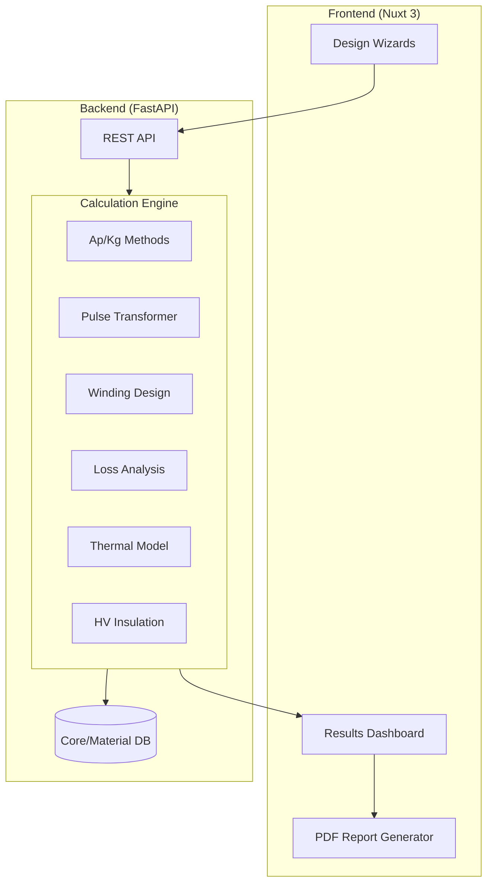

# Power Transformer Designer — Merged Implementation Plan
## Unified Framework: General Design + Pulse Transformer Support

---

## Goal Description

Build a **comprehensive Power Transformer Designer** web application combining:
- **General-purpose design** (LF/HF transformers, inductors) via McLyman's Ap/Kg methodology
- **Specialized pulse transformer support** (Dropless-style energy transfer, HV insulation)

**Sources Merged:**
- `implementation_plan_transformer_designer.md` — Clean MVP structure, phased approach
- `power_transformer_framework_plan.md` — Pulse transformer depth, HV insulation, detailed equations

---

## Architecture



---

## Phased Implementation

### Phase 1: Core MVP (15-20 hours)

#### Backend — Calculation Engine

| File | Status | Description |
|------|--------|-------------|
| `main.py` | NEW | FastAPI app, CORS, health check |
| `models/transformer.py` | NEW | Pydantic models (requirements, design results) |
| `calculations/ap_method.py` | NEW | Area Product: standard + pulse energy method |
| `calculations/kg_method.py` | NEW | Core Geometry: regulation-based design |
| `calculations/winding.py` | NEW | Turns, wire sizing, skin depth, foil option |
| `calculations/losses.py` | NEW | Core (Steinmetz) + copper (DC/AC) losses |
| `calculations/thermal.py` | NEW | Steady-state + pulsed thermal models |
| `data/cores.json` | NEW | Ferrite (EE, ETD, PQ) + Si-steel (EI) cores |
| `data/materials.json` | NEW | Ferrite grades + silicon steel properties |

#### Frontend — Nuxt 3 Application

| File | Status | Description |
|------|--------|-------------|
| `nuxt.config.ts` | NEW | Configuration, API proxy |
| `pages/index.vue` | NEW | Landing page, design type selector |
| `pages/design/transformer.vue` | NEW | General transformer wizard |
| `pages/design/inductor.vue` | NEW | Inductor design (energy storage) |
| `components/DesignForm.vue` | NEW | Reusable input form |
| `components/CoreSelector.vue` | NEW | Core selection with Ap filtering |
| `components/ResultsDashboard.vue` | NEW | Results, loss charts, verification |
| `composables/useTransformerDesign.ts` | NEW | State management, API integration |
| `assets/css/design-system.css` | NEW | Dark mode engineering aesthetics |

---

### Phase 2: Pulse Transformer Extension (10-15 hours)

| File | Status | Description |
|------|--------|-------------|
| `calculations/pulse_transformer.py` | NEW | Volt-seconds, energy transfer, peak flux |
| `calculations/waveform.py` | NEW | Non-sinusoidal waveform analysis |
| `calculations/insulation.py` | NEW | Creepage/clearance per IEC 60664 |
| `models/pulse_transformer.py` | NEW | Pydantic models for pulse requirements |
| `data/insulation.json` | NEW | Insulation materials (Nomex, Kapton) |
| `routers/pulse_transformer.py` | NEW | API endpoints for pulse design |
| `components/PulseWaveformInput.vue` | NEW | Visual waveform editor |
| `components/HighVoltageInsulation.vue` | NEW | Creepage/clearance calculator |
| `pages/design/pulse.vue` | NEW | Pulse transformer wizard |

**Key Equations (Phase 2):**
```python
# Volt-second product
V_s = ∫V(t)dt  # For capacitor discharge

# Peak flux from volt-seconds
Bpk = V_s / (N × Ae)

# Pulse Ap (energy method)
Ap = (2 × E × 10⁴) / (Bmax × J × Ku)

# Creepage distance (IEC 60664)
creepage_mm = f(voltage, pollution_degree, material_group)
```

---

### Phase 3: Database & Advanced Features (Future)

- Airtable API integration for live core database
- PDF datasheet parsing with Claude API
- PSFB-specific design wizard
- Multi-objective optimization
- Export to CAD formats

---

## Verification Plan

### Phase 1 Verification

**Test Case: 100W Flyback @ 100kHz**
```
Input: 100W, 100kHz, 48V→12V, η=90%, Bm=0.2T
Expected: Ap ≈ 0.5 cm⁴, ferrite core (ETD29 or similar)
```

### Phase 2 Verification

**Test Case: Dropless Pulse Transformer**
```json
{
  "source_capacitance_F": 0.002,
  "source_voltage_V": 200,
  "peak_current_A": 1750,
  "pulse_width_s": 0.0026,
  "output_voltage_V": 3500,
  "insulation_voltage_V": 4000
}
```
**Expected:**
- V·s ≈ 0.52 V·s
- Ae > 17.3 cm² (Si-steel EI-150 or larger)
- Creepage ≈ 25-40 mm @ 4kV

---

## Timeline Summary

| Phase | Scope | Effort |
|-------|-------|--------|
| **Phase 1** | Core MVP (general transformers + inductors) | 15-20 hours |
| **Phase 2** | Pulse transformer + HV insulation | 10-15 hours |
| **Phase 3** | Airtable + advanced features | 15-20 hours |
| **Total** | Full framework | **40-55 hours** |

---

## Technology Stack

- **Backend**: Python 3.11+, FastAPI, Pydantic, uv (package manager)
- **Frontend**: Nuxt 3, Vue 3 Composition API, TypeScript
- **Database**: JSON (Phase 1) → Airtable API (Phase 3)
- **Testing**: pytest (backend), Vitest (frontend)

---

## References

- [CLAUDE.md](file:///c:/Users/denko/Claude/transformer_designer/CLAUDE.md) — TDE specification
- [project_memory.txt](file:///c:/Users/denko/Claude/transformer_designer/project_memory.txt) — Project context
- [power_transformer_framework_plan.md](file:///c:/Users/denko/Claude/transformer_designer/power_transformer_framework_plan.md) — Pulse transformer details
- McLyman's Handbook (PDF) — Detailed equations
- IEC 60664 — Insulation coordination
