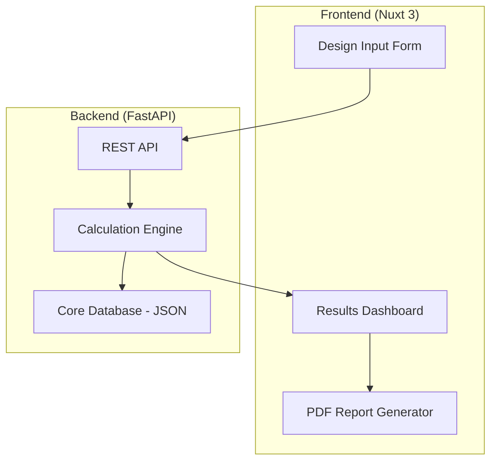

# Power Transformer Designer — Implementation Plan
## Web Application using McLyman's Ap/Kg Methodology

---

## Goal Description

Build a **professional-grade Power Transformer Designer** web application that implements the Transformer Design Expert (TDE) methodology from `CLAUDE.md`. The tool will enable engineers to:

1. Design transformers and inductors using McLyman's Area Product (Ap) and Core Geometry (Kg) methods
2. Select cores from a database (later integrated with Airtable)
3. Calculate windings, losses, and thermal performance
4. Generate professional design reports

**Key Inputs:**
- `CLAUDE.md`: Complete TDE specification with equations, procedures, and verification checklists
- `project_memory.txt`: Context on Airtable+GitHub architecture, PSFB focus, Python automation
- McLyman's Handbook (PDF): Reference for detailed calculations

---

## User Review Required

> [!IMPORTANT]
> **Technology Stack Decision Required**
> This plan proposes a **Vue.js/Nuxt 3** frontend with a **Python/FastAPI** backend. Alternative approaches:
> - Option A: Full-stack Nuxt with server routes (simpler, no separate backend)
> - Option B: Pure Python Flask with Jinja2 templates (faster MVP, less dynamic UI)
> - Option C: Vue/Nuxt + FastAPI (proposed — best for future Airtable integration)

> [!WARNING]
> **Scope Definition**
> This plan covers **Phase 1: Core Calculator** only. Database integration (Airtable) and PDF parsing are deferred to Phase 2.

---

## Proposed Architecture



---

## Proposed Changes

### Phase 1: Core MVP (This Plan)

---

#### Backend — Python/FastAPI Calculation Engine

##### [NEW] `backend/main.py`
- FastAPI application entry point
- CORS configuration for frontend
- Health check endpoint

##### [NEW] `backend/models/transformer.py`
- Pydantic models for transformer design inputs/outputs
- `TransformerRequirements`: Power, voltage, frequency, efficiency, regulation
- `CoreSelection`: Ap, Kg, material, geometry
- `WindingDesign`: Turns, wire gauge, current density
- `DesignResult`: Complete design with losses and thermal analysis

##### [NEW] `backend/calculations/ap_method.py`
- Area Product calculation: `Ap = (Pt × 10⁴) / (Kf × Ku × Bm × J × f)`
- Apparent power calculation
- Window utilization factors

##### [NEW] `backend/calculations/kg_method.py`
- Core Geometry calculation: `Kg = (Pt × 10⁴) / (2 × Ke × α)`
- Regulation-based design
- Ke electrical coefficient calculation

##### [NEW] `backend/calculations/winding.py`
- Turns calculation (Faraday's Law)
- Wire sizing: `Aw = Irms / J`
- DC resistance calculation
- AC resistance factors (skin depth, proximity)

##### [NEW] `backend/calculations/losses.py`
- Core loss (Steinmetz equation)
- Copper loss (DC + AC components)
- Total loss budget

##### [NEW] `backend/calculations/thermal.py`
- Power dissipation density: `ψ = Ptotal / At`
- Temperature rise: `Tr = 450 × ψ^0.826`
- Surface area estimation

##### [NEW] `backend/data/cores.json`
- Initial core database (10-20 common cores)
- EI, EE, ETD, PQ geometries
- Ferrite and silicon steel materials

##### [NEW] `backend/data/materials.json`
- Material properties database
- Bsat, μi, Steinmetz coefficients
- Temperature coefficients

---

#### Frontend — Nuxt 3 Application

##### [NEW] `frontend/nuxt.config.ts`
- Nuxt 3 configuration
- API proxy to backend

##### [NEW] `frontend/pages/index.vue`
- Landing page with feature overview
- Quick-start wizard

##### [NEW] `frontend/pages/design/transformer.vue`
- Main transformer design page
- Multi-step form: Requirements → Core → Winding → Results

##### [NEW] `frontend/pages/design/inductor.vue`
- Inductor design page (energy storage method)

##### [NEW] `frontend/components/DesignForm.vue`
- Reusable input form component
- Input validation
- Unit conversion helpers

##### [NEW] `frontend/components/CoreSelector.vue`
- Core selection interface
- Filter by Ap, geometry, material
- Visual core comparison

##### [NEW] `frontend/components/ResultsDashboard.vue`
- Design results display
- Loss breakdown charts
- Verification checklist (✓/⚠/❌)

##### [NEW] `frontend/components/ThermalAnalysis.vue`
- Temperature rise visualization
- Cooling recommendations

##### [NEW] `frontend/composables/useTransformerDesign.ts`
- State management for design workflow
- API integration

##### [NEW] `frontend/assets/css/design-system.css`
- Dark mode design system
- Engineering UI aesthetics

---

### Phase 2: Database Integration (Future)

- Airtable API integration for core/material database
- Real-time core selection from production database
- Design project save/load functionality

### Phase 3: Advanced Features (Future)

- PDF datasheet parsing with Claude API
- Optimization algorithms (multi-objective)
- PSFB-specific design wizard
- Export to CAD formats

---

## Verification Plan

### Automated Tests

#### Backend Unit Tests
```bash
# Run from backend directory
cd backend
uv run pytest tests/ -v
```

**Test Coverage:**
1. `test_ap_method.py`: Verify Ap calculation against McLyman examples
2. `test_kg_method.py`: Verify Kg calculation with known regulation targets
3. `test_winding.py`: Verify turns and wire sizing calculations
4. `test_losses.py`: Verify loss calculations match handbook examples
5. `test_thermal.py`: Verify temperature rise predictions

#### Frontend Tests
```bash
# Run from frontend directory
cd frontend
npm run test
```

**Test Coverage:**
1. Component rendering tests
2. Form validation tests
3. API integration tests (mocked)

### Manual Verification

#### Step 1: Backend Smoke Test
1. Start backend: `cd backend && uv run uvicorn main:app --reload`
2. Open `http://localhost:8000/docs` (Swagger UI)
3. Test `/api/design/transformer` endpoint with sample inputs
4. Verify response contains all expected fields

#### Step 2: Frontend Visual Test
1. Start frontend: `cd frontend && npm run dev`
2. Open `http://localhost:3000`
3. Complete a transformer design workflow
4. Verify results match manual calculations

#### Step 3: End-to-End Validation
Design a **100W, 100kHz flyback transformer** and compare results to McLyman handbook example:
- Input: 100W, 100kHz, 48V→12V, η=90%, Bm=0.2T
- Expected Ap: ~0.5 cm⁴
- Verify core selection, turns, losses within 10% of handbook

---

## Implementation Timeline

| Phase | Tasks | Estimated Effort |
|-------|-------|------------------|
| **1a** | Backend structure + Ap/Kg calculations | 3-4 hours |
| **1b** | Winding + loss + thermal calculations | 2-3 hours |
| **1c** | Core/material JSON database | 1-2 hours |
| **1d** | Frontend Nuxt setup + design system | 2-3 hours |
| **1e** | Design form + results components | 3-4 hours |
| **1f** | API integration + testing | 2-3 hours |
| **Total** | **Phase 1 MVP** | **13-19 hours** |

---

## Open Questions for User

1. **Technology Stack**: Confirm Vue/Nuxt + FastAPI approach, or prefer alternatives?
2. **Initial Core Database**: Start with ferrite cores (HF) or include silicon steel (LF)?
3. **Design Focus**: Prioritize PSFB transformers or general-purpose first?
4. **UI Preferences**: Any specific aesthetic requirements beyond dark mode?

---

## References

- [CLAUDE.md](file:///c:/Users/denko/Claude/transformer_designer/CLAUDE.md) — TDE specification
- [project_memory.txt](file:///c:/Users/denko/Claude/transformer_designer/project_memory.txt) — Project context
- McLyman's Handbook (PDF) — Detailed equations and examples
