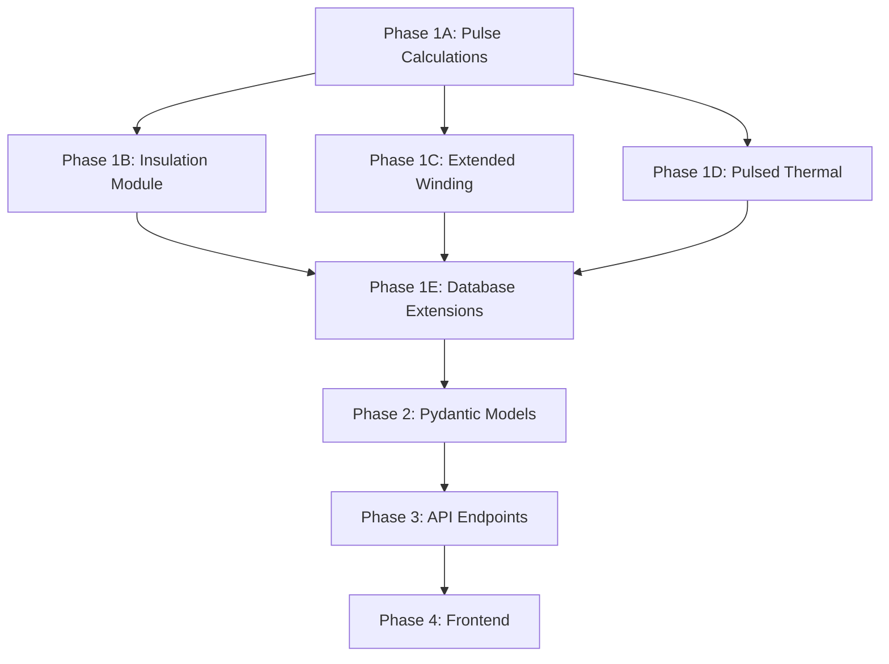

# Power Transformer Design Framework — Detailed Implementation Plan

## Supporting Pulse Transformers (Dropless), PSFB, and General LF/HF Designs

 

---

 

## Executive Summary

 

This plan extends the existing transformer designer architecture to support **pulse transformer design** (as exemplified by the Dropless transformer requirements) alongside conventional power transformer methodologies. The Dropless application represents a specialized **energy-transfer pulse transformer** with:

- Very high peak currents (1,750 A) at low duty cycle

- High voltage step-up (200V → 3.5kV)

- Millisecond-scale pulse widths at 125 Hz repetition

- Plasma generation load characteristics

 

This requires extending the McLyman Ap/Kg methodology with pulse-specific calculations for volt-second balance, peak flux density under transient conditions, and thermal management for pulsed operation.

 

---

 

## Requirements Analysis: Dropless Transformer

 

### Key Specifications Extracted

 

| Parameter | Value | Design Implication |

|-----------|-------|-------------------|

| **Primary capacitor** | 2.0 mF @ 200V | Energy source = 40 J max |

| **Peak primary current** | 1,750 A ±5% | Massive I²t, skin effect critical |

| **Pulse width** | 2.4–2.8 ms | Defines volt-second product |

| **Time to peak** | 800 µs | Non-sinusoidal waveform |

| **Repetition rate** | 125 Hz | Duty cycle ≈ 30-35% |

| **Secondary voltage** | 3.0–3.5 kV | High insulation requirements |

| **Load capacitance** | 0.11–0.16 µF | Energy transfer target ~0.67 J/pulse |

| **Average power** | 80–85 W | Thermal design baseline |

| **Turns ratio** | Np=1-2, Ns≥50 | 25:1 to 50:1 step-up |

| **Core type** | Laminated Si-steel E/I or toroid | Low frequency, high Bsat |

| **Insulation** | ≥4 kV continuous, 6 kV surge | Creepage/clearance critical |

 

### Design Challenges Unique to Pulse Transformers

 

1. **Non-sinusoidal waveform**: Cannot use standard Kf=4.44; must calculate volt-seconds directly

2. **Transient flux density**: Bpeak determined by ∫V·dt, not RMS voltage

3. **Extreme peak currents**: 1,750 A requires careful wire/foil selection and skin depth management

4. **Thermal pulsing**: Average power low (80W) but peak power extremely high

5. **High voltage insulation**: 3.5kV secondary requires proper creepage and winding techniques

6. **Energy transfer efficiency**: Must track capacitor-to-capacitor energy transfer

 

---

 

## Framework Architecture Extensions

 

### Current Architecture (from existing plan)

 

```

backend/

├── calculations/

│   ├── ap_method.py      # Area Product sizing

│   ├── kg_method.py      # Core Geometry sizing

│   ├── winding.py        # Turns, wire sizing

│   ├── losses.py         # Core + copper losses

│   └── thermal.py        # Temperature rise

├── models/

│   └── transformer.py    # Pydantic models

└── data/

    ├── cores.json        # Core database

    └── materials.json    # Material properties

```

 

### Required Extensions for Pulse Transformer Support

 

```

backend/

├── calculations/

│   ├── ap_method.py           # [EXTEND] Add pulse transformer Ap

│   ├── kg_method.py           # [EXTEND] Add pulse regulation method

│   ├── winding.py             # [EXTEND] Add foil winding, Litz selection

│   ├── losses.py              # [EXTEND] Add pulsed loss calculations

│   ├── thermal.py             # [EXTEND] Add pulsed thermal model

│   ├── pulse_transformer.py   # [NEW] Volt-second, peak flux, energy transfer

│   ├── insulation.py          # [NEW] Creepage, clearance, HV design

│   └── waveform.py            # [NEW] Non-sinusoidal waveform analysis

├── models/

│   ├── transformer.py         # [EXTEND] Add pulse transformer models

│   └── waveform.py            # [NEW] Waveform definition models

└── data/

    ├── cores.json             # [EXTEND] Add laminated Si-steel cores

    ├── materials.json         # [EXTEND] Add Si-steel properties

    └── insulation.json        # [NEW] Insulation material properties

```

 

---

 

## Detailed Implementation Plan

 

### Phase 1A: Core Calculation Engine (Existing + Pulse Extensions)

 

#### 1. Pulse Transformer Volt-Second Calculations

 

**File:** `backend/calculations/pulse_transformer.py`

 

```python

# Key equations to implement:

 

# Volt-second product (for non-sinusoidal pulses)

def volt_seconds(voltage_waveform: np.array, time_waveform: np.array) -> float:

    """

    V·s = ∫V(t)dt over pulse duration

    For rectangular: V·s = V × t_pulse

    For capacitor discharge: V·s = V0 × τ × (1 - e^(-t/τ))

    """

 

# Peak flux density from volt-seconds

def peak_flux_density(volt_seconds: float, N: int, Ae: float) -> float:

    """

    Bpk = V·s / (N × Ae)   [T]

 

    Where:

        volt_seconds: V·s product [V·s]

        N: number of turns

        Ae: effective core area [m²]

    """

 

# Energy transfer efficiency

def energy_transfer(C_pri: float, V_pri: float,

                    C_sec: float, V_sec: float,

                    turns_ratio: float) -> dict:

    """

    E_pri = 0.5 × C_pri × V_pri²

    E_sec = 0.5 × C_sec × V_sec²

    η_transfer = E_sec / E_pri

 

    Ideal: V_sec = V_pri × n (turns ratio)

    Losses: leakage inductance, resistance, core loss

    """

 

# Area Product for pulse transformer

def pulse_transformer_ap(energy_joules: float,

                         Bmax: float,

                         J: float,

                         Ku: float,

                         duty_cycle: float) -> float:

    """

    Ap = (2 × E × 10⁴) / (Bmax × J × Ku)  [cm⁴]

 

    Modified for pulse operation:

    - Use peak energy, not average

    - Account for duty cycle in thermal calculations separately

    """

```

 

#### 2. Waveform Analysis Module

 

**File:** `backend/calculations/waveform.py`

 

```python

from enum import Enum

from dataclasses import dataclass

import numpy as np

 

class WaveformType(Enum):

    SINUSOIDAL = "sinusoidal"

    SQUARE = "square"

    TRIANGULAR = "triangular"

    CAPACITOR_DISCHARGE = "capacitor_discharge"

    CUSTOM = "custom"

 

@dataclass

class PulseWaveform:

    """Define pulse characteristics for transformer design"""

    waveform_type: WaveformType

    peak_voltage: float          # V

    pulse_width: float           # seconds

    rise_time: float             # seconds (10-90%)

    fall_time: float             # seconds

    repetition_rate: float       # Hz

 

    # For capacitor discharge

    source_capacitance: float = None  # F

    circuit_resistance: float = None   # Ω

    circuit_inductance: float = None   # H

 

def calculate_volt_seconds(waveform: PulseWaveform) -> float:

    """Calculate V·s for any waveform type"""

 

def calculate_rms_voltage(waveform: PulseWaveform) -> float:

    """Calculate RMS voltage for loss calculations"""

 

def calculate_peak_current(waveform: PulseWaveform,

                           load_impedance: complex) -> float:

    """Calculate peak current for wire sizing"""

 

def waveform_coefficient(waveform: PulseWaveform) -> float:

    """

    Return Kf equivalent for Faraday's law

    Sinusoidal: 4.44

    Square: 4.0

    Pulse: Must use V·s method directly

    """

```

 

#### 3. Extended Ap/Kg Methods

 

**File:** `backend/calculations/ap_method.py` [EXTEND]

 

```python

# Add to existing file:

 

def calculate_ap_pulse_transformer(

    energy_per_pulse: float,      # Joules

    Bmax: float,                  # Tesla

    J: float,                     # A/cm²

    Ku: float,                    # Window utilization

    waveform: PulseWaveform = None

) -> dict:

    """

    Area Product for pulse/energy-transfer transformers

 

    Ap = (2 × E × 10⁴) / (Bmax × J × Ku)  [cm⁴]

 

    Returns dict with:

        - ap_cm4: calculated area product

        - methodology: "energy_storage" or "volt_second"

        - assumptions: list of design assumptions

    """

 

def calculate_ap_from_volt_seconds(

    volt_seconds: float,          # V·s

    Bmax: float,                  # Tesla

    Ku: float,                    # Window utilization

    J: float,                     # A/cm²

    Ipk: float                    # Peak current [A]

) -> dict:

    """

    Alternative Ap calculation from V·s product

 

    Ae_min = V·s / (N × Bmax)

    Wa_min = N × Ipk / (J × Ku)

    Ap = Ae × Wa

 

    Iterative: N affects both Ae and Wa requirements

    """

```

 

---

 

### Phase 1B: High-Voltage Insulation Design Module

 

**File:** `backend/calculations/insulation.py`

 

```python

"""

High-voltage insulation design per IEC 61558, IEC 60664

Critical for Dropless transformer (3.5kV secondary, 6kV surge)

"""

 

@dataclass

class InsulationRequirements:

    working_voltage: float        # V RMS or DC

    surge_voltage: float          # V peak

    pollution_degree: int         # 1-4 (IEC 60664)

    material_group: str           # I, II, IIIa, IIIb

    altitude_m: float             # meters (affects clearance)

 

def calculate_creepage(voltage: float,

                       pollution_degree: int,

                       material_group: str) -> float:

    """

    Creepage distance per IEC 60664 Table F.4

 

    Returns minimum creepage in mm

    """

 

def calculate_clearance(voltage: float,

                        pollution_degree: int,

                        altitude_m: float = 0) -> float:

    """

    Clearance (air gap) per IEC 60664 Table F.2

 

    Returns minimum clearance in mm

    Includes altitude correction factor

    """

 

def winding_build_hv(turns: int,

                     wire_diameter: float,

                     layer_insulation: float,

                     margin_tape_width: float,

                     bobbin_width: float) -> dict:

    """

    Calculate HV winding build-up with proper margins

 

    Returns:

        - layers: number of layers

        - turns_per_layer: turns per layer

        - total_height: winding height [mm]

        - creepage_achieved: actual creepage [mm]

        - recommendation: pass/fail with notes

    """

 

def recommend_insulation_system(voltage: float,

                                 temperature_class: str) -> dict:

    """

    Recommend insulation materials:

    - Wire insulation (polyester, polyimide, etc.)

    - Layer insulation (Nomex, Kapton, etc.)

    - Impregnation (varnish, epoxy, oil)

 

    Returns material recommendations with properties

    """

```

 

---

 

### Phase 1C: Extended Winding Calculations

 

**File:** `backend/calculations/winding.py` [EXTEND]

 

```python

# Add to existing file:

 

def skin_depth(frequency: float,

               material: str = "copper",

               temperature: float = 20) -> float:

    """

    δ = √(ρ / (π × f × μ₀ × μᵣ))

 

    For copper @ 20°C, 100kHz: δ ≈ 0.21 mm

    For pulse with rise time tr: f_eff ≈ 0.35 / tr

    """

 

def effective_frequency_pulse(rise_time: float) -> float:

    """

    For pulse waveforms, effective frequency for skin effect:

    f_eff = 0.35 / t_rise

 

    Dropless: t_rise ≈ 800 µs → f_eff ≈ 440 Hz

    """

 

def wire_selection_high_current(

    Ipk: float,                   # Peak current [A]

    Irms: float,                  # RMS current [A]

    frequency: float,             # Effective frequency [Hz]

    J_target: float,              # Target current density [A/cm²]

    max_layers: int = 3

) -> dict:

    """

    Select wire/foil for high-current pulse applications

 

    Options evaluated:

    - Round wire (multiple parallels)

    - Litz wire

    - Copper foil

 

    Returns recommendations with:

    - wire_type: "round", "litz", "foil"

    - gauge_or_thickness: AWG or mm

    - parallel_count: number of parallels

    - Rac_Rdc_ratio: AC/DC resistance factor

    """

 

def foil_winding_design(

    current_rms: float,           # A

    current_peak: float,          # A

    J_target: float,              # A/cm²

    skin_depth: float,            # mm

    bobbin_width: float           # mm

) -> dict:

    """

    Design copper foil winding for high-current applications

 

    Foil thickness < 2 × skin_depth for minimal AC loss

 

    Returns:

        - foil_thickness: mm

        - foil_width: mm (accounting for margins)

        - layers: number of foil layers

        - Rac_Rdc: resistance ratio

    """

 

def primary_design_pulse_transformer(

    Np: int,                      # Primary turns (1-2 for Dropless)

    Ipk: float,                   # Peak current [A]

    Irms: float,                  # RMS current [A]

    pulse_rise_time: float,       # seconds

    core_window_width: float      # mm

) -> dict:

    """

    Design primary winding for pulse transformer

 

    For Dropless (Np=1-2, Ipk=1750A):

    - Likely copper tube or heavy foil

    - May need water cooling for higher duty

 

    Returns complete primary winding specification

    """

```

 

---

 

### Phase 1D: Pulsed Thermal Model

 

**File:** `backend/calculations/thermal.py` [EXTEND]

 

```python

# Add to existing file:

 

def thermal_pulsed_operation(

    peak_power: float,            # W (instantaneous)

    average_power: float,         # W (time-averaged)

    pulse_width: float,           # seconds

    duty_cycle: float,            # fraction

    thermal_mass: float,          # J/°C (copper + core)

    thermal_resistance: float     # °C/W (to ambient)

) -> dict:

    """

    Calculate temperature for pulsed operation

 

    Two thermal time constants:

    1. τ_pulse: heating during pulse (thermal mass limited)

    2. τ_avg: steady-state (thermal resistance limited)

 

    ΔT_pulse = P_peak × t_pulse / C_thermal

    ΔT_avg = P_avg × R_thermal

 

    Returns:

        - temp_rise_pulse: transient rise per pulse [°C]

        - temp_rise_average: steady-state rise [°C]

        - temp_peak: maximum temperature [°C]

        - cooling_recommendation: natural/forced/liquid

    """

 

def thermal_mass_estimate(

    core_weight_kg: float,

    copper_weight_kg: float,

    specific_heat_core: float = 450,    # J/kg·°C (Si-steel)

    specific_heat_copper: float = 385   # J/kg·°C

) -> float:

    """

    Estimate thermal mass for transient calculations

 

    C_thermal = m_core × c_core + m_cu × c_cu  [J/°C]

    """

 

def natural_convection_rating(

    surface_area_cm2: float,

    max_temp_rise: float,

    ambient_temp: float = 40

) -> float:

    """

    Calculate power dissipation capability with natural convection

 

    ψ = 0.05 W/cm² for ΔT = 40°C (typical)

    P_max = ψ × At

 

    Dropless: ~80-85W average, needs At > 1600 cm² minimum

    """

```

 

---

 

### Phase 1E: Core and Material Database Extensions

 

**File:** `backend/data/cores.json` [EXTEND]

 

```json

{

  "laminated_ei": [

    {

      "manufacturer": "Magnetic Metals",

      "part_number": "EI-150",

      "geometry": "EI",

      "material": "M6_silicon_steel",

      "Ae_cm2": 14.5,

      "Wa_cm2": 8.7,

      "Ap_cm4": 126.15,

      "MLT_cm": 18.5,

      "lm_cm": 22.0,

      "weight_kg": 2.8,

      "stack_options_mm": [25, 38, 50, 63],

      "datasheet_url": "..."

    },

    {

      "manufacturer": "Magnetic Metals",

      "part_number": "EI-175",

      "geometry": "EI",

      "material": "M6_silicon_steel",

      "Ae_cm2": 19.8,

      "Wa_cm2": 11.8,

      "Ap_cm4": 233.64,

      "MLT_cm": 21.2,

      "lm_cm": 25.5,

      "weight_kg": 4.1,

      "stack_options_mm": [25, 38, 50, 63, 75],

      "datasheet_url": "..."

    }

  ],

  "toroidal_laminated": [

    {

      "manufacturer": "Magnetics Inc",

      "part_number": "ZW-44916-TC",

      "geometry": "toroid",

      "material": "grain_oriented_silicon_steel",

      "OD_mm": 114,

      "ID_mm": 57,

      "height_mm": 38,

      "Ae_cm2": 10.8,

      "Wa_cm2": 25.5,

      "Ap_cm4": 275.4,

      "weight_kg": 1.2

    }

  ]

}

```

 

**File:** `backend/data/materials.json` [EXTEND]

 

```json

{

  "silicon_steel": {

    "M6_grain_oriented": {

      "Bsat_T": 1.8,

      "Bmax_recommended_T": 1.5,

      "mu_i": 1500,

      "resistivity_uOhm_cm": 50,

      "density_g_cm3": 7.65,

      "steinmetz_k": 0.0109,

      "steinmetz_alpha": 1.68,

      "steinmetz_beta": 2.0,

      "loss_W_kg_60Hz_1T": 0.8,

      "loss_W_kg_60Hz_1_5T": 1.5,

      "temp_max_C": 150,

      "lamination_thickness_mm": [0.18, 0.27, 0.35]

    },

    "M19_non_oriented": {

      "Bsat_T": 1.7,

      "Bmax_recommended_T": 1.4,

      "mu_i": 500,

      "loss_W_kg_60Hz_1T": 2.0,

      "temp_max_C": 150

    }

  },

  "amorphous": {

    "2605SA1": {

      "Bsat_T": 1.56,

      "Bmax_recommended_T": 1.35,

      "mu_i": 45000,

      "loss_W_kg_60Hz_1T": 0.15,

      "temp_max_C": 150

    }

  }

}

```

 

**File:** `backend/data/insulation.json` [NEW]

 

```json

{

  "wire_insulation": {

    "polyester_enamel": {

      "temperature_class": "155",

      "dielectric_strength_V_mm": 80000,

      "typical_thickness_mm": 0.03

    },

    "polyimide": {

      "temperature_class": "220",

      "dielectric_strength_V_mm": 150000,

      "typical_thickness_mm": 0.025,

      "notes": "Kapton-based, excellent for HV"

    }

  },

  "layer_insulation": {

    "nomex_410": {

      "temperature_class": "220",

      "dielectric_strength_V_mm": 25000,

      "thickness_mm": [0.05, 0.08, 0.13, 0.18, 0.25]

    },

    "kapton": {

      "temperature_class": "260",

      "dielectric_strength_V_mm": 200000,

      "thickness_mm": [0.025, 0.05, 0.075, 0.125]

    }

  },

  "impregnation": {

    "polyester_varnish": {

      "temperature_class": "155",

      "dielectric_strength_kV_mm": 20

    },

    "epoxy_resin": {

      "temperature_class": "180",

      "dielectric_strength_kV_mm": 30,

      "notes": "Good for HV potting"

    }

  }

}

```

 

---

 

### Phase 2: Pydantic Models

 

**File:** `backend/models/transformer.py` [EXTEND]

 

```python

from pydantic import BaseModel, Field

from typing import Optional, List, Literal

from enum import Enum

 

class TransformerType(str, Enum):

    POWER_LF = "power_lf"           # 50-400 Hz line frequency

    POWER_HF = "power_hf"           # kHz-MHz SMPS

    PULSE = "pulse"                 # Energy transfer / pulse

    INDUCTOR = "inductor"           # Energy storage

 

class WaveformType(str, Enum):

    SINUSOIDAL = "sinusoidal"

    SQUARE = "square"

    PULSE_CAPACITOR = "pulse_capacitor"

    CUSTOM = "custom"

 

# --- Pulse Transformer Specific Models ---

 

class PulseTransformerRequirements(BaseModel):

    """Requirements for pulse/energy-transfer transformer"""

 

    # Energy source

    source_capacitance_F: float = Field(..., description="Primary capacitor [F]")

    source_voltage_V: float = Field(..., description="Initial capacitor voltage [V]")

 

    # Pulse characteristics

    peak_current_A: float = Field(..., description="Peak primary current [A]")

    pulse_width_s: float = Field(..., description="Pulse duration [s]")

    rise_time_s: float = Field(..., description="Rise time 10-90% [s]")

    repetition_rate_Hz: float = Field(..., description="Pulse repetition frequency [Hz]")

 

    # Output requirements

    output_voltage_V: float = Field(..., description="Target secondary voltage [V]")

    load_capacitance_F: Optional[float] = Field(None, description="Load capacitance [F]")

 

    # Constraints

    primary_turns: int = Field(default=2, ge=1, le=5, description="Primary turns")

    min_secondary_turns: int = Field(default=50, description="Minimum secondary turns")

 

    # Thermal

    ambient_temp_C: float = Field(default=40, description="Ambient temperature [°C]")

    max_temp_rise_C: float = Field(default=60, description="Max temperature rise [°C]")

    cooling: Literal["natural", "forced", "liquid"] = Field(default="natural")

 

    # Insulation

    insulation_voltage_V: float = Field(..., description="Insulation rating [V]")

    surge_voltage_V: float = Field(..., description="Surge withstand [V]")

 

class PulseTransformerDesign(BaseModel):

    """Complete pulse transformer design output"""

 

    # Core

    core_manufacturer: str

    core_part_number: str

    core_geometry: str

    core_material: str

    Ae_cm2: float

    Wa_cm2: float

    Ap_cm4: float

    lm_cm: float

 

    # Electrical

    turns_ratio: float

    Np: int

    Ns: int

    Bpeak_T: float

    volt_seconds: float

 

    # Primary winding

    primary_wire_type: str          # "foil", "tube", "round"

    primary_wire_spec: str          # AWG or dimensions

    primary_Rdc_mOhm: float

    primary_Rac_Rdc: float

 

    # Secondary winding

    secondary_wire_gauge: str

    secondary_layers: int

    secondary_turns_per_layer: int

    secondary_Rdc_Ohm: float

 

    # Insulation

    creepage_mm: float

    clearance_mm: float

    layer_insulation: str

    impregnation: str

 

    # Losses

    core_loss_W: float

    primary_copper_loss_W: float

    secondary_copper_loss_W: float

    total_loss_W: float

 

    # Thermal

    average_power_W: float

    temp_rise_C: float

    thermal_margin_C: float

 

    # Verification

    verification_status: dict       # {electrical: ✓/⚠/❌, mechanical: ..., thermal: ...}

    warnings: List[str]

    recommendations: List[str]

```

 

---

 

### Phase 3: API Endpoints

 

**File:** `backend/routers/pulse_transformer.py` [NEW]

 

```python

from fastapi import APIRouter, HTTPException

from models.transformer import PulseTransformerRequirements, PulseTransformerDesign

 

router = APIRouter(prefix="/api/design", tags=["Pulse Transformer"])

 

@router.post("/pulse-transformer", response_model=PulseTransformerDesign)

async def design_pulse_transformer(requirements: PulseTransformerRequirements):

    """

    Design a pulse/energy-transfer transformer

 

    Implements:

    1. Volt-second calculation from pulse waveform

    2. Core selection using energy method

    3. Primary winding design (high current)

    4. Secondary winding design (high voltage)

    5. Insulation design (creepage/clearance)

    6. Loss and thermal analysis

    7. Design verification

    """

 

@router.post("/pulse-transformer/verify")

async def verify_pulse_design(design: PulseTransformerDesign):

    """Verify an existing pulse transformer design"""

 

@router.get("/pulse-transformer/cores")

async def list_suitable_cores(

    min_Ap_cm4: float,

    material_type: str = "silicon_steel",

    geometry: str = None

):

    """List cores suitable for pulse transformer application"""

```

 

---

 

### Phase 4: Frontend Extensions

 

#### New Vue Components

 

**File:** `frontend/components/PulseWaveformInput.vue`

 

```vue

<!--

  Interactive waveform definition component

  - Visual waveform preview (oscilloscope-style)

  - Parameter sliders for pulse width, rise time, etc.

  - Capacitor discharge calculator

  - Real-time V·s calculation display

-->

```

 

**File:** `frontend/components/HighVoltageInsulation.vue`

 

```vue

<!--

  HV insulation design interface

  - Creepage/clearance calculator

  - Winding cross-section visualization

  - Insulation material selector

  - Standards compliance checker (IEC 60664)

-->

```

 

**File:** `frontend/components/PulseTransformerWizard.vue`

 

```vue

<!--

  Step-by-step pulse transformer design wizard

 

  Steps:

  1. Energy Source: Capacitor specs, pulse characteristics

  2. Output Requirements: Voltage, load type, protection

  3. Core Selection: Automatic recommendation with alternatives

  4. Winding Design: Primary (high-current), Secondary (high-voltage)

  5. Insulation: Creepage, clearance, materials

  6. Results: Losses, thermal, verification checklist

-->

```

 

---

 

## Implementation Order & Dependencies

 



 

### Recommended Implementation Sequence

 

| Step | Component | Dependencies | Estimated Effort |

|------|-----------|--------------|------------------|

| 1 | `waveform.py` | None | 2-3 hours |

| 2 | `pulse_transformer.py` | waveform.py | 3-4 hours |

| 3 | `insulation.py` | None | 2-3 hours |

| 4 | Extended `winding.py` | waveform.py | 2-3 hours |

| 5 | Extended `thermal.py` | None | 1-2 hours |

| 6 | Database extensions (JSON) | None | 2-3 hours |

| 7 | Pydantic models | All calculations | 2-3 hours |

| 8 | API endpoints | Models, calculations | 2-3 hours |

| 9 | Frontend components | API | 4-6 hours |

| **Total** | | | **20-30 hours** |

 

---

 

## Verification Plan: Dropless Transformer Design

 

### Test Case: Dropless Pulse Transformer

 

**Inputs:**

```json

{

  "source_capacitance_F": 0.002,

  "source_voltage_V": 200,

  "peak_current_A": 1750,

  "pulse_width_s": 0.0026,

  "rise_time_s": 0.0008,

  "repetition_rate_Hz": 125,

  "output_voltage_V": 3500,

  "load_capacitance_F": 0.00000011,

  "primary_turns": 2,

  "min_secondary_turns": 50,

  "insulation_voltage_V": 4000,

  "surge_voltage_V": 6000

}

```

 

**Expected Outputs (to verify):**

1. **Volt-seconds**: V·s ≈ 200V × 2.6ms = 0.52 V·s (for rectangular approximation)

2. **Turns ratio**: n = 3500/200 = 17.5:1 → Ns ≈ 35 turns (but min 50 specified)

3. **Peak flux density**: Bpk = V·s / (Np × Ae) → select core with Ae to keep Bpk < 1.5T

4. **Core Ae requirement**: Ae > 0.52 / (2 × 1.5) = 0.173 m² = 17.3 cm² minimum

5. **Energy per pulse**: E = 0.5 × 0.002 × 200² = 40 J (source), ~0.67 J (transferred)

6. **Average power**: ~85 W → thermal design for natural convection

7. **Creepage @ 4kV**: ~25-40 mm depending on pollution degree

 

### Manual Verification Steps

 

1. **Calculate V·s manually** and compare to tool output

2. **Verify core selection** meets Ae, Wa, and Ap requirements

3. **Check insulation distances** against IEC 60664 tables

4. **Validate thermal rise** for 85W average dissipation

5. **Confirm wire sizing** handles 1750A peak (skin depth check)

 

---

 

## Open Questions for User

 

1. **Circuit Model Accuracy**: The Dropless circuit includes a 6mH common-mode choke and plasma load (1-10Ω). Should the design tool model these for accurate waveform prediction, or use simplified assumptions?

 

2. **Core Database Priority**: Start with:

   - Option A: Common EI laminations (readily available)

   - Option B: Toroidal tape-wound cores (better performance)

   - Option C: Both

 

3. **Insulation Standards**: Design to:

   - Option A: IEC 60664 (general)

   - Option B: IEC 61558 (safety transformers)

   - Option C: Custom industrial (user-specified)

 

4. **Frontend Priority**: Build pulse transformer wizard first, or extend existing general transformer UI?

 

---

 

## References

 

- **CLAUDE.md**: TDE methodology (Ap/Kg methods, loss calculations, thermal)

- **project_memory.txt**: Airtable integration plans, PSFB focus

- **Dropless_trafo.docx**: Pulse transformer requirements (energy transfer for DLC process)

- **McLyman Handbook**: Detailed equations, design examples

- **IEC 60664**: Insulation coordination for low-voltage equipment

- **IEC 61558**: Safety of transformers

 

---

 

## Success Criteria

 

The framework will be considered complete when it can:

 

1. ✓ Accept Dropless transformer requirements as input

2. ✓ Calculate volt-seconds for capacitor discharge pulse

3. ✓ Select appropriate laminated silicon-steel core

4. ✓ Design 1-2 turn primary for 1750A peak

5. ✓ Design ≥50 turn secondary for 3.5kV output

6. ✓ Specify insulation for 4kV continuous / 6kV surge

7. ✓ Calculate losses and temperature rise for 125 Hz operation

8. ✓ Generate professional design report with verification checklist

9. ✓ Provide mechanical drawing guidance for HV winding

 

 